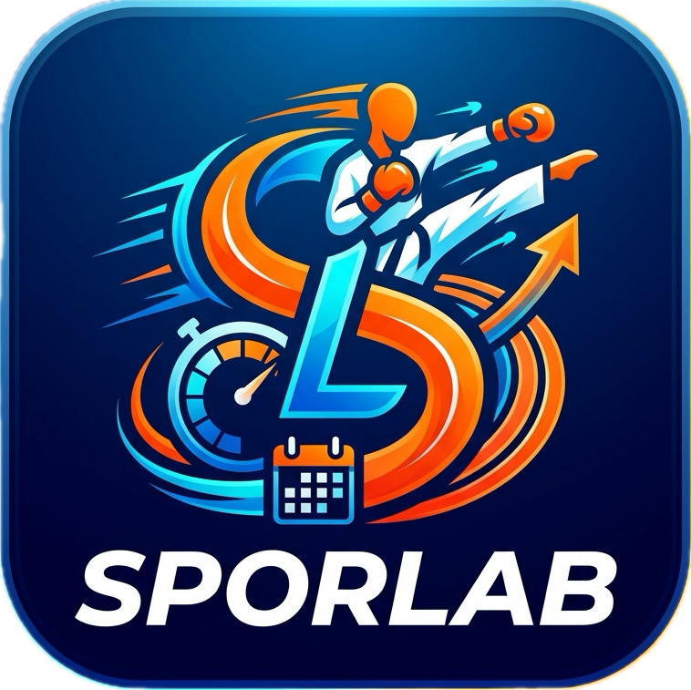
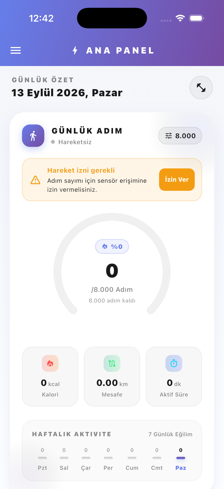
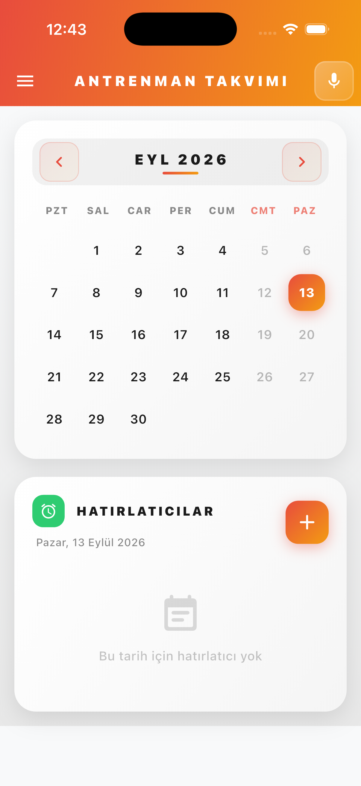
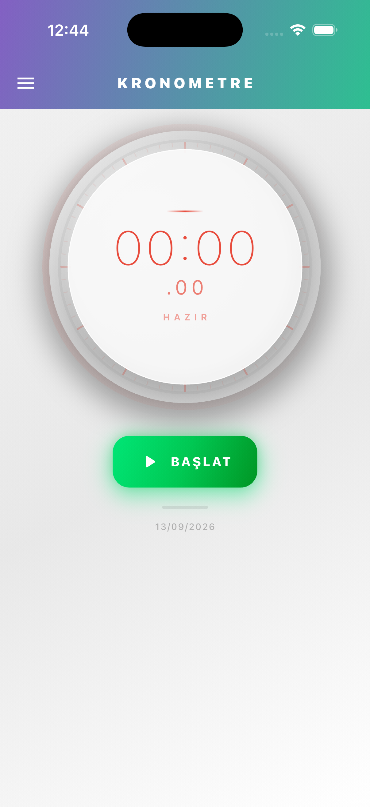
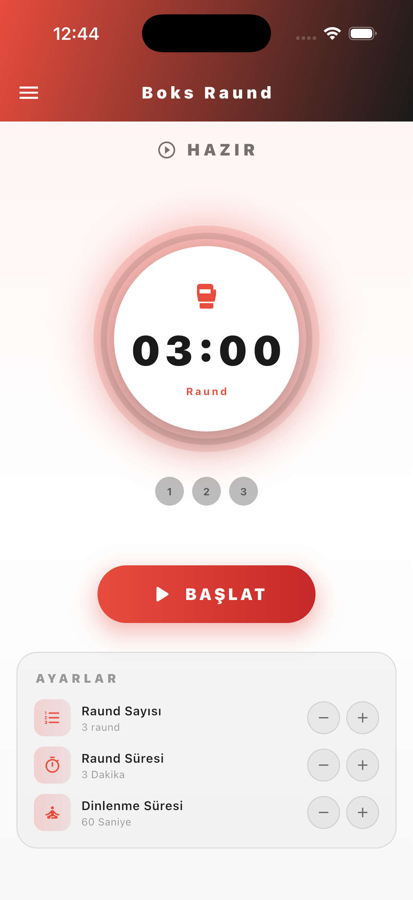
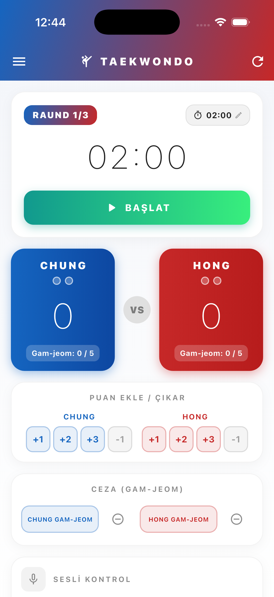
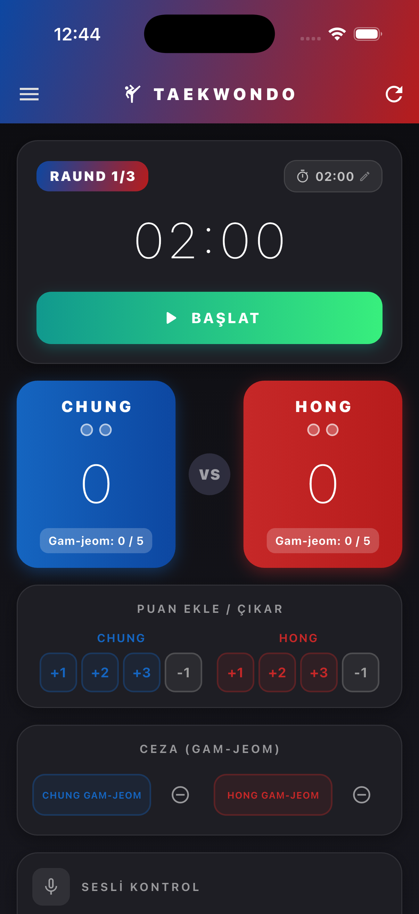
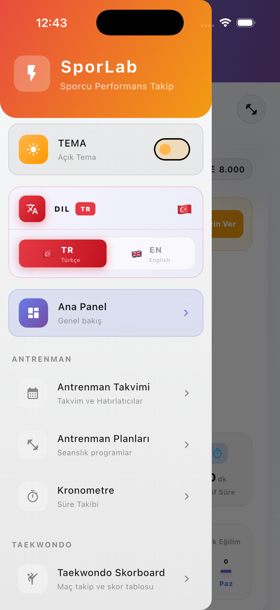

<div align="center">



# Sporlab

### 🏋️ Antrenman Takip Uygulamasi

<p>
  
  
  
  
</p>

**Sporcular ve antrenörler için gelistirilmis kapsamli yonetim sistemi**

[📱 Özellikler](#-özellikler) • [📸 Ekran Görüntüleri](#-ekran-görüntüleri) • [🚀 Kurulum](#-kurulum) • [🛠️ Teknolojiler](#-kullanilan-teknolojiler) • [📞 İletişim](#-iletişim)

</div>

---

## 📖 Uygulama Hakkinda

**Sporlab**, sporcularin antrenman planlarini olusturmasina, takip etmesine ve performanslarini analiz etmesine olanak taniman modern bir mobil uygulamadir. Flutter ile gelistirilmis olup, hem Android hem de iOS platformlarinda sorunsuz calisir.

Uygulama, sporcularin günlük antrenmanlarini planlamasina, kronometre ile süre takibi yapmasina, taekwondo skor tablosu görüntülemesine ve antrenman takvimini yönetmesine olanak tanir.

---

## ✨ Ozellikler

### 📊 Ana Panel
- Genel antrenman ozeti ve istatistikler
- Hizli erisim menusu
- Performans gostergeleri

### 📅 Antrenman Takvimi
- Takvim uzerinden gun secimi
- Secilen gune hatirlatici ekleme
- Hatirlaticilari duzenleme ve silme
- Hatirlatici olan gunlerin gorsel gostergesi
- Verilerin yerel depolama ile kalici saklanmasi

### 📋 Antrenman Planlari
- Grup dersi ve ozel ders plani olusturma
- Plan detaylarini goruntuleme
- Ilerleme takibi
- Isar veritabani ile guvenli veri saklama

### ⏱️ Kronometre
- Hassas sure olcumu
- Tur (lap) kaydi
- En iyi/en kotu tur analizi
- Toplam sure gostermi

### 🥊 Boks & Taekwondo
- Boks raund sayaci
- Taekwondo skor tablosu
- Koyu ve açik tema destegi

### 🎨 Tema Destegi
- Koyu ve acik tema secenegi
- Tema tercihinin kalici saklanmasi
- Her sayfa icin ozel gradient renk duzeni
- Material 3 tasarim sistemi

---

## 📸 Ekran Goruntuleri

### 🏠 Ana Panel
<div align="center">
  
  <p><em>Ana panel - Genel antrenman özeti ve hızlı erişim menüsü</em></p>
</div>

### 📅 Antrenman Takvimi
<div align="center">
  
  <p><em>Antrenman takvimi - Hatırlatıcı ekleme ve düzenleme</em></p>
</div>

### ⏱️ Kronometre
<div align="center">
  
  <p><em>Kronometre - Tur kaydı ve süre takibi</em></p>
</div>

### 🥊 Boks Raund Sayaci
<div align="center">
  
  <p><em>Boks raund sayaci - Antrenman süreleri için kronometre</em></p>
</div>

### 🏅 Taekwondo Skor Tablosu
<div align="center">
  <table>
    <tr>
      <td align="center">
        
        <br/>
        <em>Açık Tema</em>
      </td>
      <td align="center">
        
        <br/>
        <em>Koyu Tema</em>
      </td>
    </tr>
  </table>
  <p><em>Taekwondo skor tablosu - Koyu ve açık tema karşılaştırması</em></p>
</div>

### 🧭 Uygulama Menüsü
<div align="center">
  
  <p><em>Uygulama drawer menüsü - Kolay navigasyon</em></p>
</div>

---

## 🚀 Kurulum

### Gereksinimler
- Flutter SDK 3.10 veya uzeri
- Dart SDK 3.0 veya uzeri
- Android Studio / Xcode

### Adimlar

1. Projeyi kopyalayin:
```bash
git clone https://github.com/yclkrt/sporlab.git
cd sporlab
```

2. Bagimliliklari yukleyin:
```bash
flutter pub get
```

3. Isar veritabani semalarini olusturun:
```bash
dart run build_runner build
```

4. Uygulamayi calistirin:
```bash
flutter run
```

---

## 🛠️ Kullanilan Teknolojiler

| Teknoloji | Versiyon | Aciklama |
|-----------|----------|----------|
| Flutter | 3.10+ | UI framework |
| Dart | 3.0+ | Programlama dili |
| Riverpod | 3.3+ | State yonetimi |
| Isar | 3.1+ | Yerel veritabani |
| GoRouter | 17.5+ | Sayfa yonlendirme |
| SharedPreferences | 2.5+ | Yerel depolama |

---

## 📁 Proje Yapisi

```
sporlab/
├── lib/
│   ├── main.dart
│   ├── core/
│   │   ├── providers/theme_provider.dart
│   │   ├── theme/
│   │   │   ├── app_colors.dart
│   │   │   ├── app_gradients.dart
│   │   │   └── app_theme.dart
│   │   ├── router/app_router.dart
│   │   └── widgets/
│   │       ├── app_drawer.dart
│   │       └── main_scaffold.dart
│   └── features/
│       ├── dashboard/presentation/dashboard_page.dart
│       ├── stopwatch/
│       │   ├── presentation/stopwatch_page.dart
│       │   ├── providers/stopwatch_provider.dart
│       │   └── widgets/
│       ├── training_plans/
│       │   ├── data/
│       │   ├── model/
│       │   ├── presentation/
│       │   └── providers/
│       └── training_schedule/
│           ├── data/reminder_service.dart
│           ├── model/reminder.dart
│           ├── presentation/training_schedule.dart
│           ├── providers/reminder_provider.dart
│           └── widgets/
│               ├── calendar_widget.dart
│               └── reminder_list_widget.dart
├── pubspec.yaml
└── README.md
```

---

## 🎨 Renk Paleti & Gradientler

### Ana Renkler
| Renk | Hex | Kullanim |
|------|-----|----------|
| Primary | #E84C3D | Ana vurgu rengi |
| Secondary | #F39C12 | Ikincil vurgu |
| Accent | #2ECC71 | Basari/ilerleme |

### Sayfa Bazli Gradientler
| Sayfa | Gradient | Renkler |
|-------|----------|---------|
| Dashboard | Mavi-Mor | #667eea -> #764ba2 |
| Antrenman Takvimi | Kirmizi-Turuncu | #E84C3D -> #F39C12 |
| Antrenman Planlari | Yesil-Teal | #11998e -> #38ef7d |
| Kronometre | Mor-Yesil | #8360c3 -> #2ebf91 |

---

## 🔧 Gelistirme

### Kod Olusturma
```bash
dart run build_runner build
dart run build_runner watch
```

### Test Calistirma
```bash
flutter test
```

### Derleme
```bash
flutter build apk --release
flutter build ios --release
```

---

## 🤝 Katkida Bulunma

1. Bu repository'yi fork edin
2. Feature branch olusturun
3. Degisikliklerinizi commit edin
4. Branch'inizi push edin
5. Pull Request olusturun

---

## 📞 Iletisim

- **Gelistirici:** [@yclkrt](https://github.com/yclkrt)
- **Proje Linki:** [https://github.com/yclkrt/sporlab](https://github.com/yclkrt/sporlab)

---

<div align="center">

⭐ Bu projeyi begendiyseniz yildiz vermeyi unutmayin!

**Sporlab** - Antrenmaninizi yonetmenin akilli yolu

Made with ❤️ using Flutter

</div>
